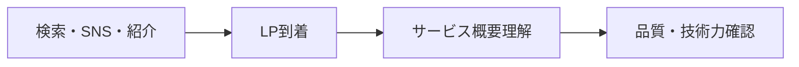
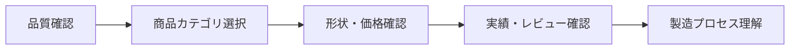
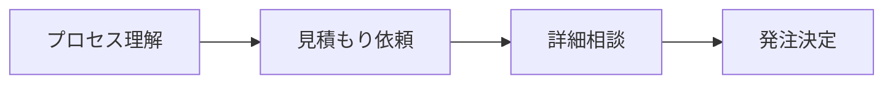

# Ghoona Goods - LP中心ウェブサイト要件定義書

## 📋 プロジェクト概要

### 1.1 プロジェクト名
**Ghoona Goods オリジナルグッズ製造サービス ウェブサイト**

### 1.2 プロジェクト目的
機構部品メーカーとしての技術力を活かしたオリジナルグッズ製造サービスの包括的なウェブプレゼンス構築

### 1.3 ビジネス目標
- **新規顧客獲得**: 月間50件の見積もり依頼獲得
- **ブランド認知向上**: 高品質・技術力・信頼性の訴求
- **サービス理解促進**: 製造プロセスと品質の可視化
- **顧客満足度向上**: 透明性のある情報提供とサポート

---

## 🎯 ターゲットユーザー

### 2.1 プライマリーターゲット
1. **企業・団体担当者**
   - イベントグッズ・ノベルティ製作担当
   - 予算：10万円〜100万円
   - 重視項目：品質・納期・コストパフォーマンス

2. **個人クリエイター・同人作家**
   - オリジナルキャラクター商品化希望
   - 予算：1万円〜10万円
   - 重視項目：小ロット対応・デザイン再現度

### 2.2 セカンダリーターゲット
3. **アニメ・ゲーム関連企業**
   - ライセンスグッズ製造
   - 予算：50万円〜500万円
   - 重視項目：品質管理・大量生産対応

---

## 🛤️ ユーザージャーニー

### 3.1 認知段階


### 3.2 検討段階


### 3.3 決定段階


---

## 📱 ウェブサイト構造

### 4.1 メインページ群

#### 4.1.1 ランディングページ（メインページ）
**URL**: `/`
**目的**: サービス全体の魅力訴求と初回コンバージョン

#### 4.1.2 商品カテゴリページ群
**URL**: `/products/*`
- `/original-badge` - オリジナル缶バッジ
- `/standard-badge` - 缶バッジ 
- `/acrylic-stand` - アクリルスタンド
- `/acrylic-keychain` - アクリルキーホルダー
- `/materials` - 素材・仕様一覧

#### 4.1.3 企業情報ページ群
**URL**: `/company/*`
- `/about` - 会社概要・技術力紹介
- `/portfolio` - 制作実績ギャラリー
- `/portfolio/[id]` - 実績詳細
- `/news` - お知らせ・実績情報
- `/overview` - サービス概要
- `/testimonials` - お客様の声

#### 4.1.4 サポートページ群
**URL**: `/support/*`
- `/contact` - お問い合わせ・見積もり依頼
- `/faq` - よくある質問
- `/data-guide` - データ入稿ガイド
- `/manufacturing-guide` - 製造工程ガイド
- `/return-policy` - 返品・交換ポリシー

#### 4.1.5 法的ページ群
**URL**: `/legal/*`
- `/terms` - 利用規約
- `/privacy` - プライバシーポリシー
- `/law` - 特定商取引法
- `/size-guide` - サイズガイド

---

## 🎨 ランディングページ詳細設計

### 5.1 セクション構成

#### 5.1.1 ヒーローセクション
**目的**: 第一印象でのインパクトとサービス価値提案
- **キャッチコピー**: 「職人の技術が生み出す、世界に一つだけの特別なグッズ」
- **サブコピー**: 機構部品メーカーの精密技術による高品質製造
- **CTAボタン**: 「無料見積もりを始める」「実績を見る」
- **ビジュアル要素**: 製造過程のアニメーション、商品画像

#### 5.1.2 強みセクション
**目的**: 競合差別化と信頼性構築
1. **プレミアム品質**
   - Made in Japan品質
   - 航空宇宙グレード素材使用
   - 品質満足度98%

2. **スケーラブル対応**
   - 1個〜30万個まで対応
   - 最短24時間出荷
   - ROI最大化システム

3. **トータルソリューション**
   - 商品制作〜配送まで一貫対応
   - 工程削減85%
   - ワンストップサービス

#### 5.1.3 品質ショーケース
**目的**: 技術力と品質の可視化
- 精密技術の紹介
- 品質管理プロセス
- 使用素材の詳細説明

#### 5.1.4 商品選択セクション
**目的**: 商品理解と購買意欲促進
- **商品カテゴリ**: 4つの主力商品タブ形式
- **形状選択**: 各商品の利用可能形状を視覚的に表示
- **詳細情報**: 価格・最小ロット・納期の明示
- **技術仕様**: 印刷技術・素材情報

#### 5.1.5 商品比較セクション
**目的**: 商品選択の意思決定支援
- 価格帯別比較
- 用途別推奨
- 特徴の視覚的比較

#### 5.1.6 実績ギャラリー
**目的**: 実績による信頼性構築
- 業界別実績表示
- ビフォーアフター表示
- 制作数・満足度統計

#### 5.1.7 お客様の声
**目的**: 社会的証明による信頼性向上
- 業界別レビュー
- 具体的な効果・満足度
- 写真付きテスティモニアル

#### 5.1.8 製造プロセス
**目的**: 透明性と専門性の訴求
- 7段階の製造工程
- 品質チェックポイント
- 技術的優位性の説明

#### 5.1.9 ニュース・実績
**目的**: 最新情報と活動状況の伝達
- 最新実績3件
- お知らせ情報
- 業界トレンド情報

---

## 🔧 技術仕様

### 6.1 フロントエンド技術スタック
- **フレームワーク**: Next.js 14 (App Router)
- **言語**: TypeScript
- **スタイリング**: Tailwind CSS
- **状態管理**: React Hooks (useState, useEffect)
- **アニメーション**: CSS Transforms & Transitions
- **アイコン**: Unicode Emoji + カスタムSVG

### 6.2 バックエンド技術スタック
- **フレームワーク**: FastAPI (Python)
- **データベース**: Supabase (PostgreSQL)
- **認証**: Clerk
- **API設計**: RESTful API
- **データ検証**: Pydantic

### 6.3 インフラ・デプロイ
- **フロントエンド**: Vercel
- **バックエンド**: Docker + クラウドプラットフォーム
- **データベース**: Supabase Cloud
- **ドメイン管理**: DNS設定
- **SSL証明書**: 自動更新対応

### 6.4 パフォーマンス要件
- **ページ読み込み時間**: 3秒以内
- **モバイル対応**: レスポンシブデザイン
- **SEO対応**: メタタグ・構造化データ
- **アクセシビリティ**: WCAG 2.1 AA準拠

---

## 🎯 機能要件

### 7.1 基本機能

#### 7.1.1 商品選択・設定機能
- 商品カテゴリ選択（4種類）
- 形状選択（商品別）
- サイズ選択
- 数量設定
- リアルタイム価格計算

#### 7.1.2 見積もり・問い合わせ機能
- 見積もりフォーム
- ファイルアップロード機能
- 要望テキスト入力
- 連絡先情報入力
- 自動返信メール送信

#### 7.1.3 実績表示機能
- カテゴリ別フィルタリング
- 年度別フィルタリング
- 業界別フィルタリング
- キーワード検索
- 実績詳細表示

#### 7.1.4 コンテンツ管理機能
- ニュース記事表示
- 実績情報更新
- お客様の声管理
- FAQ管理

### 7.2 高度な機能

#### 7.2.1 ユーザー体験向上
- スムーズスクロール
- ローディングアニメーション
- ホバーエフェクト
- レスポンシブデザイン
- 段階的コンテンツ表示

#### 7.2.2 SEO・マーケティング
- 構造化データマークアップ
- OpenGraph対応
- サイトマップ生成
- Google Analytics統合
- コンバージョン追跡

#### 7.2.3 管理機能
- コンテンツ管理システム
- 問い合わせ管理
- 実績データ管理
- ユーザー行動分析

---

## 📊 データ設計

### 8.1 主要エンティティ

#### 8.1.1 商品カテゴリ (Product Categories)
```typescript
interface ProductCategory {
  id: string
  name: string
  description: string
  base_price: number
  min_quantity: number
  max_quantity: number
  production_time: string
  available_shapes: Shape[]
  specifications: Specification[]
}
```

#### 8.1.2 制作実績 (Portfolio)
```typescript
interface Portfolio {
  id: string
  title: string
  category: string
  industry: string
  year: number
  description: string
  images: string[]
  specifications: object
  client_feedback?: string
  created_at: timestamp
}
```

#### 8.1.3 見積もり依頼 (Quote Request)
```typescript
interface QuoteRequest {
  id: string
  product_category: string
  shape: string
  quantity: number
  customer_info: CustomerInfo
  requirements: string
  files: File[]
  status: 'pending' | 'quoted' | 'accepted' | 'completed'
  created_at: timestamp
}
```

#### 8.1.4 ニュース記事 (News)
```typescript
interface News {
  id: string
  title: string
  content: string
  category: string
  published_at: timestamp
  featured_image?: string
  is_featured: boolean
}
```

---

## 🎨 デザインシステム

### 9.1 カラーパレット
- **Primary**: 企業ブランドカラー
- **Secondary**: アクセントカラー
- **Background**: 白系グラデーション
- **Text**: グレースケール（可読性重視）
- **Success**: 緑系（完了・成功状態）
- **Warning**: オレンジ系（注意喚起）
- **Error**: 赤系（エラー状態）

### 9.2 タイポグラフィ
- **見出し**: 大胆で印象的なフォント
- **本文**: 可読性重視の清潔なフォント
- **UI要素**: モダンで機能的なフォント
- **レスポンシブ**: 画面サイズに応じた最適化

### 9.3 コンポーネント設計
- **アトミック**: 最小単位の再利用可能要素
- **モレキュラー**: アトミック要素の組み合わせ
- **オーガニズム**: 複合的な機能ブロック
- **テンプレート**: ページレイアウト構造
- **ページ**: 完成されたユーザーインターフェース

---

## 📈 成功指標・KPI

### 10.1 ビジネスKPI
- **コンバージョン率**: 見積もり依頼数 / 訪問者数
- **問い合わせ数**: 月間目標50件
- **平均滞在時間**: 3分以上
- **直帰率**: 50%以下
- **リピート率**: 問い合わせ後の発注率30%以上

### 10.2 技術KPI
- **ページ読み込み速度**: Core Web Vitals良好
- **モバイル対応**: Mobile-Friendly Test合格
- **SEOスコア**: Lighthouse 90点以上
- **アクセシビリティ**: WCAG 2.1 AA準拠
- **稼働率**: 99.9%以上

### 10.3 ユーザー体験KPI
- **ユーザビリティテスト**: タスク完了率90%以上
- **顧客満足度**: フィードバック評価4.5/5以上
- **サポート問い合わせ**: 使い方に関する質問10%以下

---

## 🚀 開発・運用計画

### 11.1 開発フェーズ
1. **フェーズ1**: LP基本機能実装（4週間）
2. **フェーズ2**: 商品詳細・実績ページ（3週間）
3. **フェーズ3**: 管理機能・API統合（3週間）
4. **フェーズ4**: テスト・最適化（2週間）
5. **フェーズ5**: 本番リリース・運用開始（1週間）

### 11.2 品質保証
- **テスト戦略**: ユニット・統合・E2Eテスト
- **ブラウザ対応**: Chrome、Firefox、Safari、Edge
- **デバイステスト**: PC、タブレット、スマートフォン
- **パフォーマンステスト**: 負荷テスト・ストレステスト

### 11.3 運用・保守
- **モニタリング**: エラー監視・パフォーマンス監視
- **バックアップ**: 自動バックアップ（日次・週次）
- **アップデート**: セキュリティパッチ・機能追加
- **分析・改善**: Google Analytics・ヒートマップ分析

---

## 📋 プロジェクト管理

### 12.1 ステークホルダー
- **プロジェクトオーナー**: 事業責任者
- **プロダクトマネージャー**: 要件定義・進捗管理
- **デザイナー**: UI/UX設計
- **フロントエンド開発者**: ユーザーインターフェース実装
- **バックエンド開発者**: API・データベース実装
- **QAエンジニア**: 品質保証・テスト

### 12.2 コミュニケーション
- **定例会議**: 週次進捗確認（毎週金曜日）
- **スプリントレビュー**: 2週間毎の成果物確認
- **緊急対応**: Slack・メールでの即座連絡
- **ドキュメント管理**: Notion・GitHub

### 12.3 リスク管理
- **技術リスク**: 新技術採用による開発遅延
- **スケジュールリスク**: 要件変更による納期遅延
- **品質リスク**: テスト不足による不具合
- **運用リスク**: サーバーダウン・セキュリティ事故

---

## ✅ 完了条件

### 13.1 機能完了条件
- [ ] 全セクションの実装完了
- [ ] レスポンシブデザイン対応
- [ ] 問い合わせフォーム動作確認
- [ ] 実績データ表示機能
- [ ] 管理画面での更新機能

### 13.2 品質完了条件
- [ ] 全ブラウザでの動作確認
- [ ] ページ読み込み速度3秒以内
- [ ] SEO最適化完了
- [ ] アクセシビリティテスト合格
- [ ] セキュリティテスト合格

### 13.3 運用完了条件
- [ ] 本番環境デプロイ完了
- [ ] 監視システム設定完了
- [ ] バックアップシステム確認
- [ ] 運用手順書作成完了
- [ ] 緊急時対応手順確立

---

*本要件定義書は、プロジェクトの進行に応じて継続的に更新されます。*

**最終更新**: 2025年6月26日
**バージョン**: 1.0
**承認者**: プロジェクトオーナー