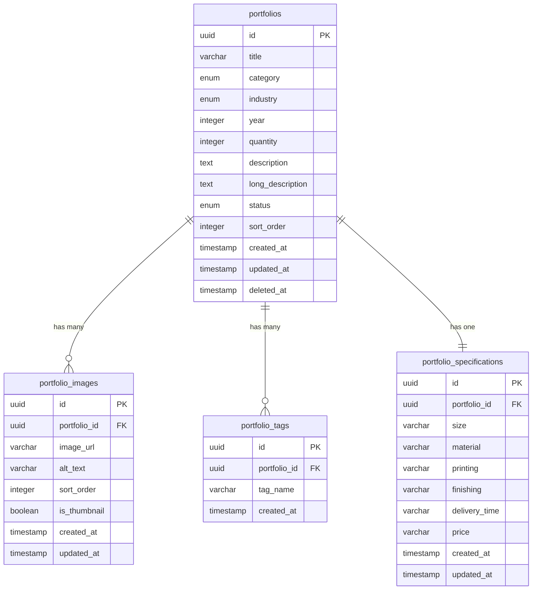

# データベース設計 - ER図

## 概要
製造実績管理システムのためのデータベース構造設計

## Mermaid ER図



## テーブル構成

### 1. portfolios（製造実績）
```sql
portfolios
├── id (UUID, PRIMARY KEY)
├── title (VARCHAR(255), NOT NULL) - 実績タイトル
├── category (ENUM, NOT NULL) - 商品カテゴリ
│   ├── 'original-badge'
│   ├── 'standard-badge'
│   ├── 'acrylic-stand'
│   └── 'acrylic-keychain'
├── industry (ENUM, NOT NULL) - 業界・用途
│   ├── 'anime'
│   ├── 'corporate'
│   ├── 'event'
│   └── 'personal'
├── year (INTEGER, NOT NULL) - 製造年度
├── quantity (INTEGER, NOT NULL) - 製造数量
├── description (TEXT) - 短い説明
├── long_description (TEXT) - 詳細説明
├── status (ENUM, DEFAULT 'active') - 公開状態
│   ├── 'active' - 公開中
│   ├── 'draft' - 下書き
│   └── 'archived' - アーカイブ
├── sort_order (INTEGER, DEFAULT 0) - 表示順序
├── created_at (TIMESTAMP, DEFAULT NOW())
├── updated_at (TIMESTAMP, DEFAULT NOW())
└── deleted_at (TIMESTAMP, NULL) - ソフトデリート
```

### 2. portfolio_images（実績画像）
```sql
portfolio_images
├── id (UUID, PRIMARY KEY)
├── portfolio_id (UUID, FOREIGN KEY → portfolios.id)
├── image_url (VARCHAR(500), NOT NULL) - 画像URL
├── alt_text (VARCHAR(255)) - 代替テキスト
├── sort_order (INTEGER, DEFAULT 0) - 画像表示順序
├── is_thumbnail (BOOLEAN, DEFAULT FALSE) - サムネイル画像フラグ
├── created_at (TIMESTAMP, DEFAULT NOW())
└── updated_at (TIMESTAMP, DEFAULT NOW())
```

### 3. portfolio_tags（実績タグ）
```sql
portfolio_tags
├── id (UUID, PRIMARY KEY)
├── portfolio_id (UUID, FOREIGN KEY → portfolios.id)
├── tag_name (VARCHAR(50), NOT NULL) - タグ名
├── created_at (TIMESTAMP, DEFAULT NOW())
└── UNIQUE(portfolio_id, tag_name) - 同一実績内での重複防止
```

### 4. portfolio_specifications（実績仕様）
```sql
portfolio_specifications
├── id (UUID, PRIMARY KEY)
├── portfolio_id (UUID, FOREIGN KEY → portfolios.id, UNIQUE)
├── size (VARCHAR(100)) - サイズ
├── material (VARCHAR(200)) - 素材
├── printing (VARCHAR(200)) - 印刷方式
├── finishing (VARCHAR(200)) - 仕上げ
├── delivery_time (VARCHAR(50)) - 納期
├── price (VARCHAR(100)) - 参考価格
├── created_at (TIMESTAMP, DEFAULT NOW())
└── updated_at (TIMESTAMP, DEFAULT NOW())
```


## インデックス設計

### portfolios テーブル
- `idx_portfolios_category` ON (category)
- `idx_portfolios_industry` ON (industry)
- `idx_portfolios_year` ON (year)
- `idx_portfolios_status` ON (status)
- `idx_portfolios_sort_order` ON (sort_order)
- `idx_portfolios_created_at` ON (created_at)

### portfolio_images テーブル
- `idx_portfolio_images_portfolio_id` ON (portfolio_id)
- `idx_portfolio_images_sort_order` ON (sort_order)
- `idx_portfolio_images_is_thumbnail` ON (is_thumbnail)

### portfolio_tags テーブル
- `idx_portfolio_tags_portfolio_id` ON (portfolio_id)
- `idx_portfolio_tags_tag_name` ON (tag_name)

## サンプルクエリ

### 1. 実績一覧取得（フィルタリング付き）
```sql
SELECT 
    p.*,
    pi.image_url as thumbnail_url,
    COUNT(pt.id) as tag_count
FROM portfolios p
LEFT JOIN portfolio_images pi ON p.id = pi.portfolio_id AND pi.is_thumbnail = TRUE
LEFT JOIN portfolio_tags pt ON p.id = pt.portfolio_id
WHERE p.status = 'active'
    AND p.category = ? -- フィルター条件
    AND p.year = ? -- フィルター条件
GROUP BY p.id, pi.image_url
ORDER BY p.sort_order ASC, p.created_at DESC;
```

### 2. 実績詳細取得
```sql
-- 基本情報
SELECT * FROM portfolios WHERE id = ? AND status = 'active';

-- 画像一覧
SELECT * FROM portfolio_images 
WHERE portfolio_id = ? 
ORDER BY sort_order ASC;

-- タグ一覧
SELECT tag_name FROM portfolio_tags 
WHERE portfolio_id = ?;

-- 仕様情報
SELECT * FROM portfolio_specifications 
WHERE portfolio_id = ?;
```

### 3. 統計情報取得
```sql
SELECT 
    category,
    COUNT(*) as count,
    SUM(quantity) as total_quantity
FROM portfolios 
WHERE status = 'active'
GROUP BY category;
```

## 設計の考慮点

### 1. スケーラビリティ
- UUIDを使用してスケールアウトに対応
- 画像とタグを別テーブルに分離して正規化

### 2. パフォーマンス
- 適切なインデックス設計
- サムネイル画像の明示的な管理
- ソート順序の事前計算

### 3. 運用性
- ソフトデリート対応
- 公開状態管理
- タイムスタンプによる変更履歴

### 4. 拡張性
- ENUMによる制約と拡張の両立
- 仕様情報の柔軟な管理
- 多言語対応への準備（将来的にlocaleカラム追加可能）

## Migration順序
1. portfolios
2. portfolio_images
3. portfolio_tags  
4. portfolio_specifications
5. インデックス作成