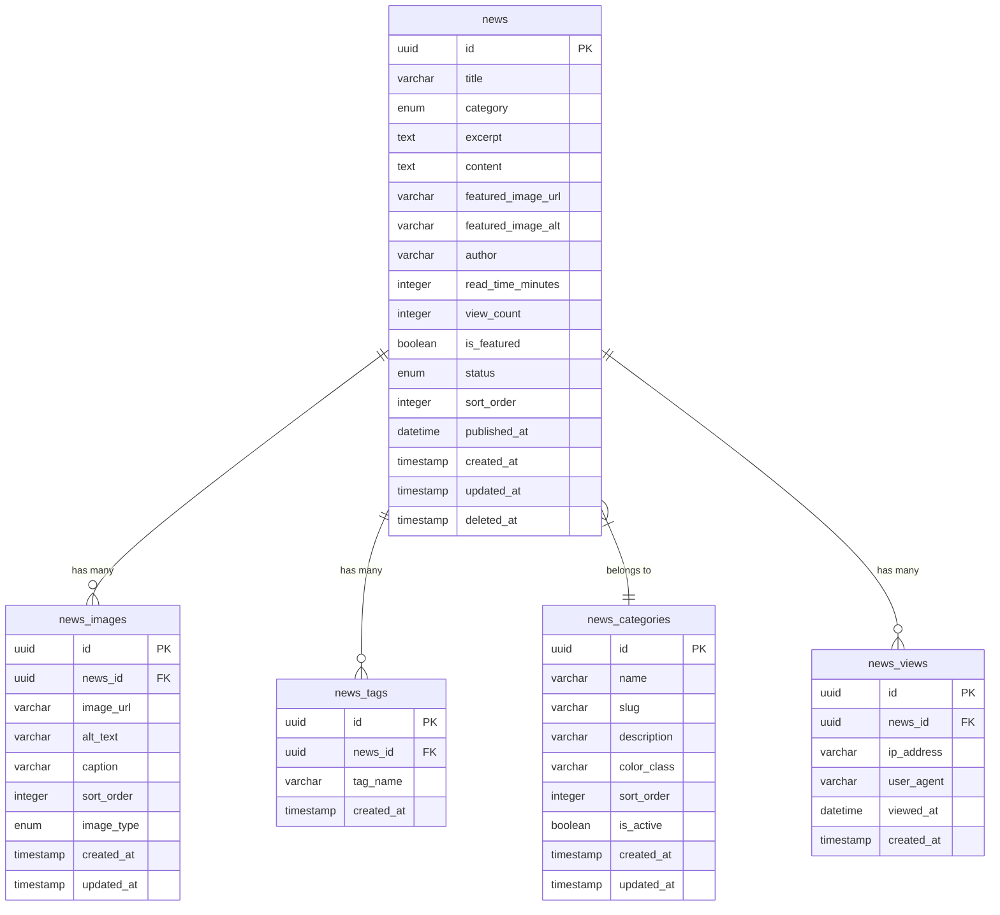

# ニュース機能のデータベース設計 - ER図

## 概要
Ghoona Goodsサイトのニュース機能のためのデータベース構造設計

## Mermaid ER図



## テーブル構成

### 1. news（ニュース記事）
```sql
news
├── id (UUID, PRIMARY KEY)
├── title (VARCHAR(255), NOT NULL) - 記事タイトル
├── category (ENUM, NOT NULL) - カテゴリ
│   ├── '新商品'
│   ├── 'お知らせ'
│   ├── 'キャンペーン'
│   ├── '技術'
│   └── 'イベント'
├── excerpt (TEXT) - 要約・抜粋
├── content (TEXT, NOT NULL) - 記事本文（HTML）
├── featured_image_url (VARCHAR(500)) - アイキャッチ画像URL
├── featured_image_alt (VARCHAR(255)) - アイキャッチ画像代替テキスト
├── author (VARCHAR(100), DEFAULT 'Ghoona Goods') - 著者名
├── read_time_minutes (INTEGER, DEFAULT 3) - 読了時間（分）
├── view_count (INTEGER, DEFAULT 0) - 閲覧数
├── is_featured (BOOLEAN, DEFAULT FALSE) - 注目記事フラグ
├── status (ENUM, DEFAULT 'draft') - 公開状態
│   ├── 'draft' - 下書き
│   ├── 'published' - 公開中
│   ├── 'scheduled' - 予約投稿
│   └── 'archived' - アーカイブ
├── sort_order (INTEGER, DEFAULT 0) - 表示順序
├── published_at (DATETIME) - 公開日時
├── created_at (TIMESTAMP, DEFAULT NOW())
├── updated_at (TIMESTAMP, DEFAULT NOW())
└── deleted_at (TIMESTAMP, NULL) - ソフトデリート
```

### 2. news_images（記事画像）
```sql
news_images
├── id (UUID, PRIMARY KEY)
├── news_id (UUID, FOREIGN KEY → news.id)
├── image_url (VARCHAR(500), NOT NULL) - 画像URL
├── alt_text (VARCHAR(255)) - 代替テキスト
├── caption (TEXT) - 画像キャプション
├── sort_order (INTEGER, DEFAULT 0) - 画像表示順序
├── image_type (ENUM, DEFAULT 'content') - 画像種別
│   ├── 'featured' - アイキャッチ
│   ├── 'content' - 記事内画像
│   └── 'gallery' - ギャラリー画像
├── created_at (TIMESTAMP, DEFAULT NOW())
└── updated_at (TIMESTAMP, DEFAULT NOW())
```

### 3. news_tags（記事タグ）
```sql
news_tags
├── id (UUID, PRIMARY KEY)
├── news_id (UUID, FOREIGN KEY → news.id)
├── tag_name (VARCHAR(50), NOT NULL) - タグ名
├── created_at (TIMESTAMP, DEFAULT NOW())
└── UNIQUE(news_id, tag_name) - 同一記事内での重複防止
```

### 4. news_categories（ニュースカテゴリ）
```sql
news_categories
├── id (UUID, PRIMARY KEY)
├── name (VARCHAR(50), NOT NULL, UNIQUE) - カテゴリ名
├── slug (VARCHAR(50), NOT NULL, UNIQUE) - URLスラッグ
├── description (TEXT) - カテゴリ説明
├── color_class (VARCHAR(50)) - CSSカラークラス
├── sort_order (INTEGER, DEFAULT 0) - 表示順序
├── is_active (BOOLEAN, DEFAULT TRUE) - アクティブフラグ
├── created_at (TIMESTAMP, DEFAULT NOW())
└── updated_at (TIMESTAMP, DEFAULT NOW())
```

### 5. news_views（閲覧履歴）
```sql
news_views
├── id (UUID, PRIMARY KEY)
├── news_id (UUID, FOREIGN KEY → news.id)
├── ip_address (VARCHAR(45)) - IPアドレス（IPv6対応）
├── user_agent (TEXT) - ユーザーエージェント
├── viewed_at (DATETIME, NOT NULL) - 閲覧日時
├── created_at (TIMESTAMP, DEFAULT NOW())
└── INDEX(news_id, ip_address, viewed_at) - 重複閲覧防止
```

## インデックス設計

### news テーブル
- `idx_news_category` ON (category)
- `idx_news_status` ON (status)
- `idx_news_published_at` ON (published_at)
- `idx_news_is_featured` ON (is_featured)
- `idx_news_sort_order` ON (sort_order)
- `idx_news_view_count` ON (view_count)

### news_images テーブル
- `idx_news_images_news_id` ON (news_id)
- `idx_news_images_sort_order` ON (sort_order)
- `idx_news_images_image_type` ON (image_type)

### news_tags テーブル
- `idx_news_tags_news_id` ON (news_id)
- `idx_news_tags_tag_name` ON (tag_name)

### news_views テーブル
- `idx_news_views_news_id` ON (news_id)
- `idx_news_views_viewed_at` ON (viewed_at)

## サンプルクエリ

### 1. ニュース一覧取得（フィルタリング付き）
```sql
SELECT 
    n.*,
    nc.name as category_name,
    nc.color_class as category_color,
    COUNT(DISTINCT nt.id) as tag_count
FROM news n
LEFT JOIN news_categories nc ON n.category = nc.slug
LEFT JOIN news_tags nt ON n.id = nt.news_id
WHERE n.status = 'published'
    AND n.published_at <= NOW()
    AND (? IS NULL OR n.category = ?) -- カテゴリフィルター
    AND (? IS NULL OR YEAR(n.published_at) = ?) -- 年度フィルター
    AND (? IS NULL OR n.title LIKE ? OR n.excerpt LIKE ?) -- 検索
GROUP BY n.id
ORDER BY n.is_featured DESC, n.published_at DESC
LIMIT ? OFFSET ?;
```

### 2. ニュース詳細取得
```sql
-- 基本情報
SELECT n.*, nc.name as category_name, nc.color_class as category_color
FROM news n
LEFT JOIN news_categories nc ON n.category = nc.slug
WHERE n.id = ? AND n.status = 'published';

-- 画像一覧
SELECT * FROM news_images 
WHERE news_id = ? 
ORDER BY sort_order ASC;

-- タグ一覧
SELECT tag_name FROM news_tags 
WHERE news_id = ?
ORDER BY tag_name ASC;

-- 関連記事
SELECT id, title, category, excerpt, featured_image_url, published_at
FROM news 
WHERE category = ? AND id != ? AND status = 'published'
ORDER BY published_at DESC
LIMIT 3;
```

### 3. 統計情報取得
```sql
-- カテゴリ別統計
SELECT 
    nc.name as category_name,
    nc.slug as category_slug,
    COUNT(n.id) as article_count,
    SUM(n.view_count) as total_views
FROM news_categories nc
LEFT JOIN news n ON nc.slug = n.category AND n.status = 'published'
WHERE nc.is_active = TRUE
GROUP BY nc.id, nc.name, nc.slug
ORDER BY nc.sort_order ASC;

-- 人気記事
SELECT id, title, view_count, published_at
FROM news 
WHERE status = 'published'
ORDER BY view_count DESC
LIMIT 10;
```

### 4. 閲覧数更新
```sql
-- 重複チェック付き閲覧数カウント
INSERT INTO news_views (news_id, ip_address, user_agent, viewed_at)
SELECT ?, ?, ?, NOW()
WHERE NOT EXISTS (
    SELECT 1 FROM news_views 
    WHERE news_id = ? 
    AND ip_address = ? 
    AND viewed_at > DATE_SUB(NOW(), INTERVAL 1 HOUR)
);

-- 閲覧数更新
UPDATE news 
SET view_count = (
    SELECT COUNT(DISTINCT ip_address) 
    FROM news_views 
    WHERE news_id = ?
)
WHERE id = ?;
```

## データ初期投入

### カテゴリ初期データ
```sql
INSERT INTO news_categories (id, name, slug, description, color_class, sort_order) VALUES
(uuid(), '新商品', '新商品', '新製品の発表・紹介', 'bg-blue-500', 1),
(uuid(), 'お知らせ', 'お知らせ', '重要なお知らせ・連絡事項', 'bg-green-500', 2),
(uuid(), 'キャンペーン', 'キャンペーン', 'セール・キャンペーン情報', 'bg-red-500', 3),
(uuid(), '技術', '技術', '技術革新・品質向上の取り組み', 'bg-purple-500', 4),
(uuid(), 'イベント', 'イベント', '展示会・イベント参加情報', 'bg-orange-500', 5);
```

## 設計の考慮点

### 1. スケーラビリティ
- UUIDを使用してスケールアウトに対応
- カテゴリを別テーブルに分離して拡張性確保
- 閲覧履歴の効率的な管理

### 2. パフォーマンス
- 適切なインデックス設計
- 公開状態・日時による効率的な絞り込み
- 閲覧数の重複カウント防止

### 3. 運用性
- ソフトデリート対応
- 公開状態・予約投稿機能
- 注目記事の管理

### 4. SEO・UX
- 記事URL用のスラッグ管理
- 読了時間の事前計算
- 関連記事の効率的な取得

## Migration順序
1. news_categories
2. news
3. news_images
4. news_tags
5. news_views
6. インデックス作成
7. 初期データ投入